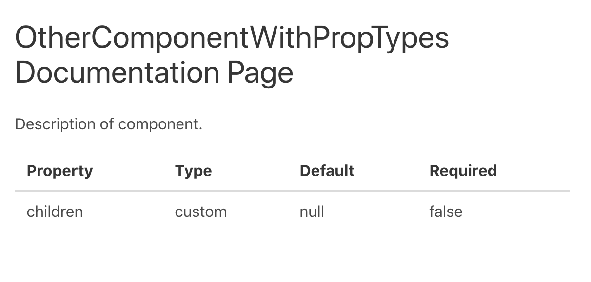

[](https://circleci.com/gh/hipstersmoothie/workflows/ignite-plugin-prop-types/tree/master) [](https://codecov.io/gh/hipstersmoothie/ignite-plugin-prop-types/branch/master)

<div align="center">
  
  <h1>
    Ignite-Plugin-Prop-Types
  </h1>
  <p>Takes a react component and displays a table with it's prop-types.</p>
</div>

## Usage

Install the plugin:

```bash
yarn add ignite-plugin-prop-types
```

Add it to your `.igniterc` or `package.json`:

```json
{
  "plugins": [
    ["PropTypes", "ignite-plugin-prop-types"],
    ["OtherComponentWithPropTypes", "/path/to/component"]
  ]
}
```

Use in your documentation:

```markdown
# OtherComponentWithPropTypes Documentation Page

Description of component.

<PropTypes component='OtherComponentWithPropTypes' />
```

Result:


